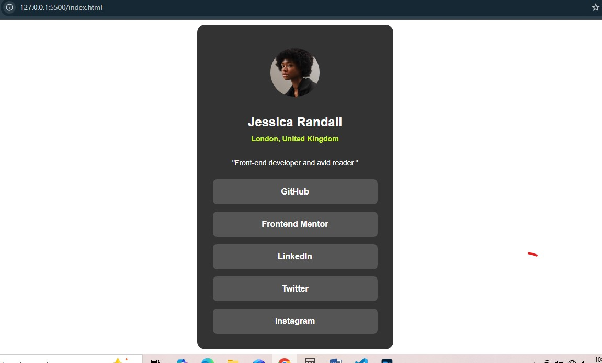

# Frontend Mentor - Social links profile solution

This is a solution to the [Social links profile challenge on Frontend Mentor](https://www.frontendmentor.io/challenges/social-links-profile-UG32l9m6dQ). Frontend Mentor challenges help you improve your coding skills by building realistic projects. 

## Table of contents

  - [The challenge](#the-challenge)
  - [Screenshot](#screenshot)
  - [Links](#links)
  - [Built with](#built-with)
  - [What I learned](#what-i-learned)
  - [Continued development](#continued-development)
  - [Useful resources](#useful-resources)
- [Author](#author)

### The challenge
- Added hover effect

### Screenshot

### Links

- Live Site URL: )

### Built with

- Semantic HTML5 markup
- CSS custom properties
- CSS Grid
- Mobile-first workflow

### What I learned
- I improved in creating responsive design
- I learnt how to use section, main instead of div

### Continued development

-I'm not comfortable with my html codes, i'm looking forward to improve in writing semantic html codes

### Useful resources

- [Google](https://www.goole.com) - This helped me for research. I really liked this pattern and will use it going forward.
- [Gemini](https://www.gemini.google.com) - This is an amazing web tool which helped me finally understand how to style li and a element have one hover effect. I'd recommend it to anyone still learning this concept.

## Author

- Website - [Samuel C.](https://www.your-site.com)
- Frontend Mentor - [@yourusername](https://www.frontendmentor.io/profile/yourusername)
- Twitter - [@yourusername](https://www.twitter.com/yourusername)

